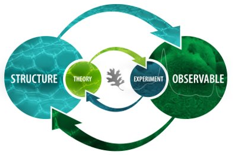

The goal of this project is to develop a machine learning-driven scientific framework to support characterization of unknown uranium-bearing samples. This framework, named Smart Spectral Matching (SSM), investigates subtle attributes of spectral signatures from Raman and infrared spectroscopic data and enables statistical identification of connections between underlying structural units and spectroscopic information, particularly in fuel cycle materials that are amorphous or a mixture of several phases. A characteristic stretch of the uranyl (O=U=O)2+ ion is observed in the Raman spectrum of uranyl materials, implying other such signatory relationships may exist between local structural subunits on the atomic scale and the vibrational spectra. Should other coordination units in uranium materials prove to have similarly important spectral features, this would greatly enhance characterization using optical vibrational spectroscopy and provide insight into the local order present in low symmetry and amorphous samples. Machine learning is the perfect tool to develop these correlations because of the multidimensional nature of the structural and spectroscopic datasets. To address the small data challenge, training data for SSM will be collected into CURIES, a compendium of Raman and infrared experimental spectra of uranium oxide materials. CURIES and SSM will enable identification of new signatures that can be leveraged to support material characterization for nonproliferation and to provide additional knowledge about a given sample history. SSM will be developed with end-users in mind by integrating the machine learning framework with secure scientific data storage for CURIES. The SSM platform will result in a powerful, readily deployable, and user-friendly resource for the nonproliferation community.

